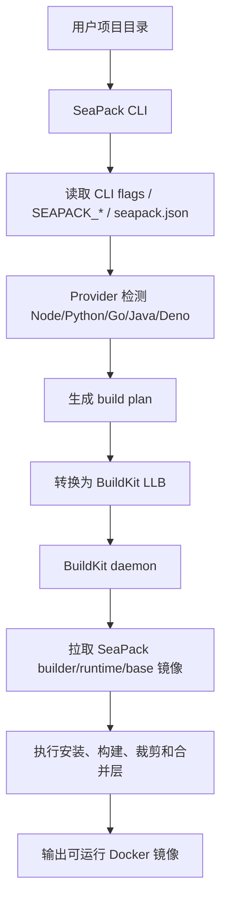

# SeaPack 功能说明

SeaPack 是面向 Sealos 应用构建场景的零配置镜像构建 CLI。它会读取项目目录，分析应用语言和包管理方式，生成 JSON build plan，再把 build plan 转换成 BuildKit LLB，最终构建出可运行的 Docker 镜像。

本版本的目标是保留核心闭环，不做全语言平台：

- 分析项目
- 生成 build plan
- 通过 BuildKit 构建镜像
- 输出可运行的最终镜像

## 支持范围

SeaPack 当前只启用以下语言 provider：

- Node.js
- Python
- Go
- Java
- Deno

以下非 MVP provider 已从主检测链路移除：PHP、Ruby、Rust、Elixir、Gleam、C/C++、Dotnet、Staticfile、Shell、Procfile。相关源码暂时保留在仓库中，便于以后参考或重新启用，但 `core/providers/provider.go` 不再注册它们。

## 主要模块

### CLI

入口：`cmd/cli/main.go`

CLI 名称已改为 `seapack`，全局 verbose 环境变量改为 `SEAPACK_VERBOSE`。

主要命令：

- `seapack build <dir>`：分析项目并用 BuildKit 构建镜像。
- `seapack prepare <dir>`：生成平台构建所需的 plan/info 文件。
- `seapack plan <dir>`：输出 build plan。
- `seapack info <dir>`：输出分析结果、provider、包版本和元数据。
- `seapack schema`：输出 `seapack.json` JSON schema。
- `seapack frontend`：启动 BuildKit gateway frontend。

### Core

入口：`core/core.go`

职责：

- 合并 CLI 选项、`SEAPACK_*` 环境变量、`seapack.json` 配置文件。
- 调用 provider 检测项目类型。
- 创建 `GenerateContext`。
- 收集 package 版本、steps、caches、secrets、deploy 信息。
- 校验 build plan。
- 返回 `BuildResult`，JSON 字段为 `seapackVersion`。

默认配置文件：`seapack.json`

### Providers

入口：`core/providers/provider.go`

当前启用 provider：

- `core/providers/node`
- `core/providers/python`
- `core/providers/golang`
- `core/providers/java`
- `core/providers/deno`

provider 职责：

- `Detect`：判断目录是否属于该语言项目。
- `Plan`：生成安装、构建、运行需要的 steps。
- `CleansePlan`：移除最终镜像不需要的内容。
- `StartCommandHelp`：提供缺少启动命令时的提示。

### Generate

目录：`core/generate`

职责：

- 维护 build steps。
- 生成 mise 安装步骤。
- 生成 command/image/install-bin steps。
- 合并用户自定义 config 和 provider 生成结果。
- 生成最终 `plan.BuildPlan`。

关键镜像：

- builder：`ghcr.io/gitlayzer/seapack-builder:mise-<mise-version>`
- runtime：`ghcr.io/gitlayzer/seapack-runtime:mise-<mise-version>`

当前 mise 版本来自：`core/mise/version.txt`

### Plan

目录：`core/plan`

Build plan 是 SeaPack 和 BuildKit 之间的中间格式，包含：

- `steps`：构建阶段。
- `caches`：BuildKit cache mounts。
- `secrets`：构建期 secret。
- `deploy`：最终镜像层、环境变量、PATH、启动命令。

### BuildKit

目录：`buildkit`

职责：

- `build.go`：本地 CLI 连接 BuildKit daemon 并执行构建。
- `convert.go`：把 `plan.BuildPlan` 转换成 LLB。
- `frontend.go`：BuildKit gateway frontend，供平台侧直接用 frontend 镜像构建。
- `build_llb`：把 step graph、cache、secret、layer merge 转成 BuildKit LLB。

默认 BuildKit daemon 镜像：

- `ghcr.io/gitlayzer/seapack-buildkit:latest`

secret hash helper 使用：

- `ghcr.io/gitlayzer/seapack-alpine:latest`

## 镜像体系

SeaPack 统一使用以下 GHCR 镜像仓库：

| 镜像 | 用途 | 当前标签 |
| --- | --- | --- |
| `ghcr.io/gitlayzer/seapack-alpine` | Alpine 基础层，供 frontend 和 BuildKit secret helper 使用 | `latest` |
| `ghcr.io/gitlayzer/seapack-buildkit` | 本地/平台 BuildKit daemon | `latest` |
| `ghcr.io/gitlayzer/seapack-builder` | 构建阶段基础镜像，包含 mise 和构建依赖 | `mise-2026.3.17` |
| `ghcr.io/gitlayzer/seapack-runtime` | 最终应用运行时基础镜像 | `mise-2026.3.17` |
| `ghcr.io/gitlayzer/seapack-frontend` | BuildKit gateway frontend，内置 `seapack frontend` | `latest` |

镜像定义：

- `images/alpine/base/Dockerfile`
- `images/buildkit/Dockerfile`
- `images/debian/build/Dockerfile`
- `images/debian/runtime/Dockerfile`
- `images/alpine/frontend/Dockerfile`
- `images/alpine/frontend/goreleaser.Dockerfile`

## 构建流程



## 本地开发命令

按项目约定使用 mise：

```bash
mise run check
mise run test
mise run run-buildkit-container
mise run cli -- --verbose build --show-plan --name seapack-node-npm-e2e examples/node-npm --progress=plain
docker run --rm seapack-node-npm-e2e
```

镜像构建任务：

```bash
mise run image-alpine-build
mise run image-buildkit-build
mise run image-builder-build
mise run image-runtime-build
mise run image-frontend-build
```

## 当前验证结果

已通过：

- `mise run check`
- `mise run test`
- GoReleaser 配置校验
- GitHub Actions workflow 校验
- Node 端到端构建：`examples/node-npm`
- Node 最终镜像运行：输出 `hello from Node v23.5.0`
- Python/Go/Java/Deno 计划生成验证，均使用 `ghcr.io/gitlayzer/seapack-builder` 和 `ghcr.io/gitlayzer/seapack-runtime`

## 发布目标镜像

- `ghcr.io/gitlayzer/seapack-alpine:latest`
- `ghcr.io/gitlayzer/seapack-buildkit:latest`
- `ghcr.io/gitlayzer/seapack-builder:mise-2026.3.17`
- `ghcr.io/gitlayzer/seapack-runtime:mise-2026.3.17`
- `ghcr.io/gitlayzer/seapack-frontend:latest`

## 后续建议

下一阶段可以继续做两件事：

- 删除或移动未启用 provider，减少测试和维护面。
- 继续按 Sealos 实际产品形态补齐平台侧集成文档和发布流程。
